<div align="center">

# OmniShift


</div>

## Overview

OmniShift is a **framework** that converts any supported CNN backbone into a multiply-free network by applying four independently toggleable quantization techniques:

| Component | Description | Effect |
|-----------|-------------|--------|
| Sparse Shift | W in {0, +/-2^p} | Conv multiplications -> bit-shifts + skip-zero |
| PoT-BN | gamma/sigma -> +/-2^q | BN scale multiplication -> shift |
| PoT-Act | Post-ReLU -> {0} U {2^p} | Activation quantization to log-uniform grid |
| EWGS | Element-Wise Gradient Scaling | Replaces STE backward for smoother training |

**Energy model (45nm CMOS):** `mul = 3.7 pJ`, `add = 0.9 pJ`, `shift = 0.13 pJ`

---

## Quick Start

```bash
pip install -r requirements.txt

cd OmniShift

# Sanity check - all 8 methods
python3 -c "
from src.models.resnet_cifar import build_model
from src.utils.ops_counter import count_mul_add_shift
from src.quantize.pot_bn import set_bn_epoch
import torch

for method in ['fp32', 'deepshift', 'apot', 'denseshift', 's3shift', 'fogzo', 'aptq', 'omnishift']:
    m = build_model('resnet20', method, num_classes=10)
    set_bn_epoch(m, 999)
    out = m(torch.randn(2, 3, 32, 32))
    ops = count_mul_add_shift(m)
    print(f'{method:12s}  shape={out.shape}  energy={ops[\"energy_GpJ\"]:.4f} GpJ')
"

# Run experiment
python scripts/run_experiment.py --config configs/omnishift.yaml
python scripts/run_experiment.py --config configs/omnishift.yaml --method deepshift --dataset svhn

# Print results table
python scripts/summarize_results.py

# Plot training curves -> saves 12 images to assets/
python scripts/plot.py
```

---

## Supported Backbones & Datasets

**Backbones:** `resnet20`, `resnet56`

**Datasets:** `cifar10`, `svhn`, `stl10`

---

## Baselines

| Method | Paper | Authors | ArXiv | Venue |
|--------|-------|---------|-------|-------|
| `fp32` | - | - | - | - |
| `deepshift` | DeepShift: Towards Multiplication-Less Neural Networks | Elhoushi et al. | [1905.13298](https://arxiv.org/abs/1905.13298) | CVPR-W 2021 |
| `apot` | Additive Power-of-Two Quantization | Li et al. | [1909.13144](https://arxiv.org/abs/1909.13144) | ICLR 2020 |
| `denseshift` | DenseShift: Towards Accurate and Efficient Low-Bit Power-of-Two Quantization | Li et al. | [2208.09708](https://arxiv.org/abs/2208.09708) | ICCV 2023 |
| `s3shift` | S3: Sign-Sparse-Shift Reparametrization for Effective Training of Low-Bit Shift Networks | Li et al. | [2107.03453](https://arxiv.org/abs/2107.03453) | NeurIPS 2021 |
| `fogzo` | FOGZO: First-Order-Guided Zeroth-Order Gradient Descent for Quantization-Aware Training | Yang & Aamodt | [2510.23926](https://arxiv.org/abs/2510.23926) | NeurIPS 2025 |
| `aptq` | APTQ: Adaptive Global Power-of-Two Ternary Quantization | Liu et al. | - | Sensors (MDPI) 2024 |
| `omnishift` | OmniShift (this work) | - | - | - |

> `apot` uses a single-term PoT grid (step = alpha / 2^(n_bits-1)) rather than the original additive multi-term construction. `aptq` has no public arXiv preprint; DOI: 10.3390/s24010181.

---

## Project Structure

```
OmniShift/
├── src/
|   ├── quantize/
|   |   ├── shift.py           # ShiftConv2d - W in {+/-2^p} (DeepShift-PS)
|   |   ├── sparse_shift.py    # SparseShiftConv2d - W in {0, +/-2^p}
|   |   ├── s3shift.py         # S3ShiftConv2d - sign x sparse x shift
|   |   ├── fogzo.py           # FogzoShiftConv2d - ZO-augmented STE
|   |   ├── aptq_ternary.py    # APTQTernaryConv2d - two-sub-filter PoT ternary
|   |   ├── apot.py            # APoTConv2d - additive PoT grid
|   |   ├── denseshift.py      # DenseShiftConv2d - sign x shift, no zero
|   |   ├── pot_bn.py          # PoTBatchNorm2d, set_bn_epoch
|   |   ├── pot_act.py         # PoTActivation
|   |   └── ewgs.py            # EWGS variants of all quantizers
|   |
|   ├── methods/
|   |   ├── __init__.py        # get_factories(), METHODS list
|   |   ├── fp32.py            # FP32 baseline
|   |   ├── deepshift.py       # DeepShift-PS
|   |   ├── apot.py            # APoT
|   |   ├── denseshift.py      # DenseShift
|   |   ├── s3shift.py         # S3
|   |   ├── fogzo.py           # FOGZO
|   |   ├── aptq_ternary.py    # APTQ
|   |   └── omnishift.py       # OmniShift full pipeline
|   | 
|   ├── models/
|   |   └── resnet_cifar.py    # ResNetCIFAR, build_model()
|   |
|   ├── data/
|   |   └── loaders.py         # get_dataloaders (cifar10, svhn, stl10)
|   |
|   ├── training/
|   |   ├── train.py           # train_one_epoch, evaluate, EarlyStopping
|   |   ├── scheduler.py       # cosine_lr_schedule
|   |   └── regularize.py      # L1 sparsity regularization
|   |
|   └── utils/
|       ├── ops_counter.py     # hook-based backbone-agnostic op counter
|       ├── seed.py            # set_seed, clear_memory
|       └── checkpoint.py      # save_checkpoint, save_log
|   
├── configs/
|   └── omnishift.yaml         # unified config (edit method/backbone/dataset)
|   
├── scripts/
|   ├── run_experiment.py      # training entry point (CLI + Python API)
|   ├── summarize_results.py   # print results table from logs/
|   ├── update_readme.py       # auto-update Results section from logs/
|   ├── plot.py                # generate training curve plots -> assets/
|   ├── fpga_estimate.py       # Xilinx 7-series resource estimation
|   └── trt_benchmark.py       # TensorRT FP16 benchmark
|   
└── notebooks/
    └── omnishift.ipynb        # Kaggle notebook (setup / config / train / results)
```

---

## Configuration

Edit `configs/omnishift.yaml` or pass `--method`/`--dataset` flags:

```yaml
experiment:
  method:   "omnishift"   # fp32 | deepshift | apot | denseshift | s3shift | fogzo | aptq | omnishift
  backbone: "resnet20"    # resnet20 | resnet56
  dataset:  "cifar10"     # cifar10 | svhn | stl10
  seed:     42

training:
  epochs:          200
  batch_size:      256
  lr:              0.1      # cosine decay
  sparsity_lambda: 0.0001   # L1 regularization (learnable sparse mode)
```

Method-specific opts via Python API:

```python
from scripts.run_experiment import build_cfg, run

cfg = build_cfg('omnishift', 'resnet20', 'cifar10', seed=42, epochs=200,
                sparse_mode='learnable', bn_warmup=30)
result = run(cfg)
```

---

## Outputs

Each run saves two files under backbone-specific subdirectories:

```
checkpoints/{backbone}/{run_name}_{dataset}_seed{seed}.pt   # best weights + metadata
logs/{backbone}/{run_name}_{dataset}_seed{seed}.json        # per-epoch loss/acc log
```

---

## Results

### ResNet20

#### CIFAR-10

| Method | Test Acc | Sparsity | Energy (GpJ) | vs FP32 |
|--------|:--------:|:--------:|:------------:|:-------:|
| omnishift | 83.01% | 89.03% | 0.0068 | **27.6x** |
| aptq | 91.35% | 74.90% | 0.0134 | **14.1x** |
| apot | 91.27% | 0.00% | 0.0445 | **4.2x** |
| deepshift | 92.23% | 0.00% | 0.0445 | **4.2x** |
| denseshift | 90.56% | 0.00% | 0.0445 | **4.2x** |
| fogzo | 90.72% | 0.00% | 0.0445 | **4.2x** |
| s3shift | 90.58% | 0.00% | 0.0445 | **4.2x** |
| fp32 (baseline) | 92.17% | 0.00% | 0.1887 | 1.0x |

#### SVHN

| Method | Test Acc | Sparsity | Energy (GpJ) | vs FP32 |
|--------|:--------:|:--------:|:------------:|:-------:|
| omnishift | 94.78% | 93.43% | 0.0050 | **37.7x** |
| aptq | 96.50% | 84.61% | 0.0094 | **20.1x** |
| apot | 96.54% | 0.00% | 0.0445 | **4.2x** |
| deepshift | 96.73% | 0.00% | 0.0445 | **4.2x** |
| denseshift | 96.47% | 0.00% | 0.0445 | **4.2x** |
| fogzo | 95.98% | 0.00% | 0.0445 | **4.2x** |
| s3shift | 96.36% | 0.00% | 0.0445 | **4.2x** |
| fp32 (baseline) | 96.82% | 0.00% | 0.1887 | 1.0x |

#### STL-10

| Method | Test Acc | Sparsity | Energy (GpJ) | vs FP32 |
|--------|:--------:|:--------:|:------------:|:-------:|
| omnishift | 65.92% | 64.29% | 0.0171 | **11.0x** |
| aptq | 65.50% | 51.17% | 0.0233 | **8.1x** |
| apot | 66.88% | 0.00% | 0.0445 | **4.2x** |
| deepshift | 67.54% | 0.00% | 0.0445 | **4.2x** |
| denseshift | 68.46% | 0.00% | 0.0445 | **4.2x** |
| fogzo | 59.03% | 0.00% | 0.0445 | **4.2x** |
| s3shift | 68.11% | 0.00% | 0.0445 | **4.2x** |
| fp32 (baseline) | 67.62% | 0.00% | 0.1887 | 1.0x |

---

### ResNet56

#### CIFAR-10

| Method | Test Acc | Sparsity | Energy (GpJ) | vs FP32 |
|--------|:--------:|:--------:|:------------:|:-------:|
| omnishift | 83.59% | 96.89% | 0.0067 | **87.0x** |
| aptq | 91.84% | 91.83% | 0.0151 | **38.5x** |
| apot | 92.69% | 0.00% | 0.1336 | **4.3x** |
| deepshift | 93.80% | 0.00% | 0.1336 | **4.3x** |
| denseshift | 92.53% | 0.00% | 0.1336 | **4.3x** |
| fogzo | 92.50% | 0.00% | 0.1336 | **4.3x** |
| s3shift | 92.40% | 0.00% | 0.1336 | **4.3x** |
| fp32 (baseline) | 93.67% | 0.00% | 0.5809 | 1.0x |

#### SVHN

| Method | Test Acc | Sparsity | Energy (GpJ) | vs FP32 |
|--------|:--------:|:--------:|:------------:|:-------:|
| omnishift | 95.03% | 97.97% | 0.0053 | **109.7x** |
| aptq | 96.38% | 96.16% | 0.0095 | **61.1x** |
| apot | 96.68% | 0.00% | 0.1336 | **4.3x** |
| deepshift | 96.73% | 0.00% | 0.1336 | **4.3x** |
| denseshift | 96.69% | 0.00% | 0.1336 | **4.3x** |
| fogzo | 96.34% | 0.00% | 0.1336 | **4.3x** |
| s3shift | 96.74% | 0.00% | 0.1336 | **4.3x** |
| fp32 (baseline) | 96.75% | 0.00% | 0.5809 | 1.0x |

#### STL-10

| Method | Test Acc | Sparsity | Energy (GpJ) | vs FP32 |
|--------|:--------:|:--------:|:------------:|:-------:|
| omnishift | 60.62% | 73.77% | 0.0365 | **15.9x** |
| aptq | 63.19% | 64.40% | 0.0505 | **11.5x** |
| apot | 65.49% | 0.00% | 0.1336 | **4.3x** |
| deepshift | 67.29% | 0.00% | 0.1336 | **4.3x** |
| denseshift | 67.27% | 0.00% | 0.1336 | **4.3x** |
| fogzo | 56.23% | 0.00% | 0.1336 | **4.3x** |
| s3shift | 67.22% | 0.00% | 0.1336 | **4.3x** |
| fp32 (baseline) | 66.95% | 0.00% | 0.5809 | 1.0x |

---

## Training Curves

All 8 methods per chart. Dashed lines = train, solid lines = val.

> Run `python scripts/plot.py` to regenerate these images from logs/.

### ResNet-20

| Dataset | Loss | Accuracy |
|---------|:----:|:--------:|
| CIFAR-10 | 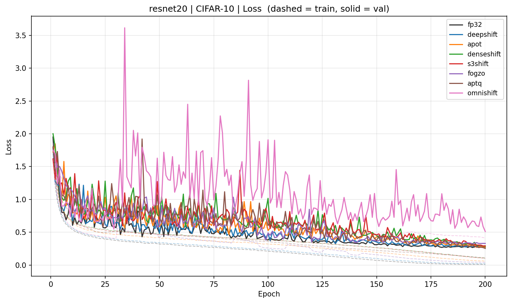 | 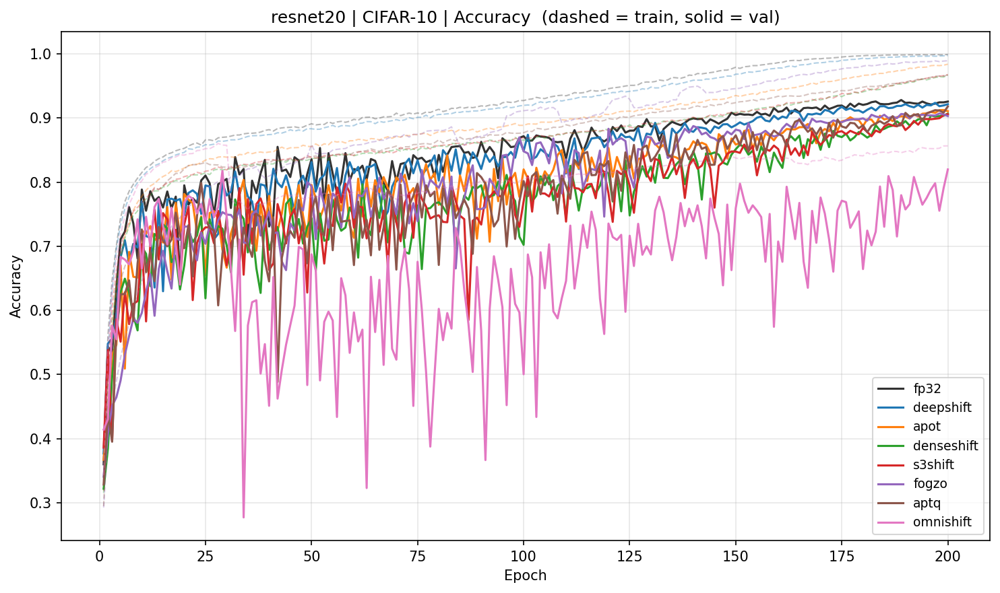 |
| SVHN | 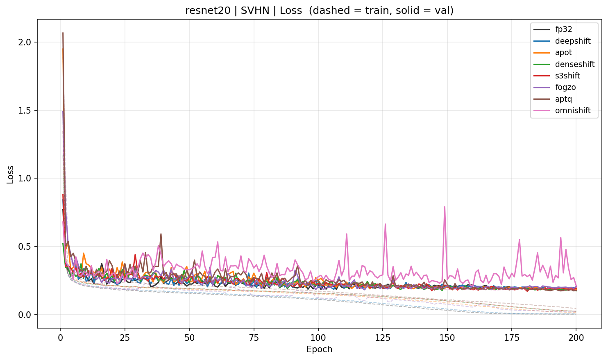 | 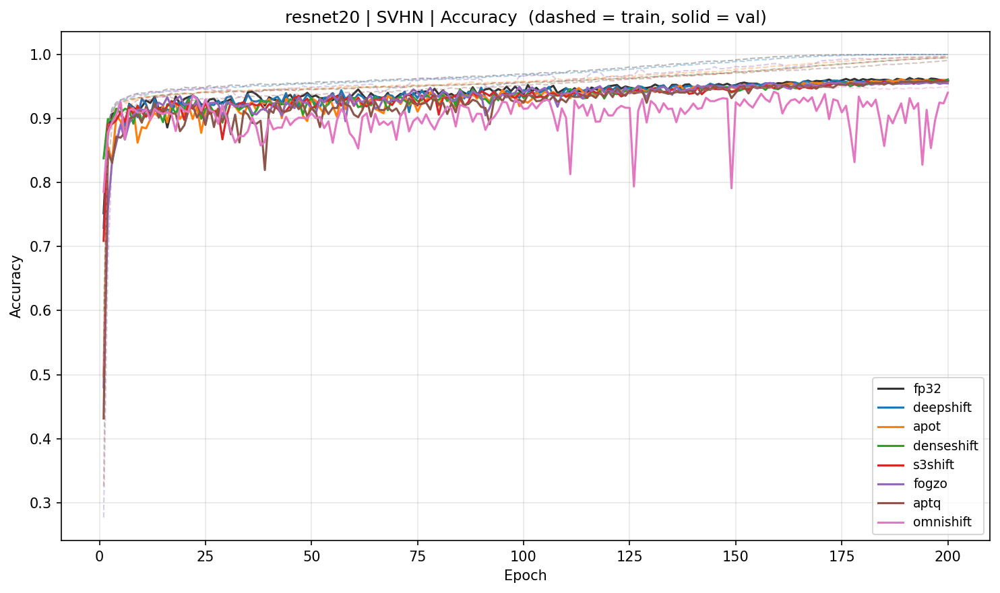 |
| STL-10 | 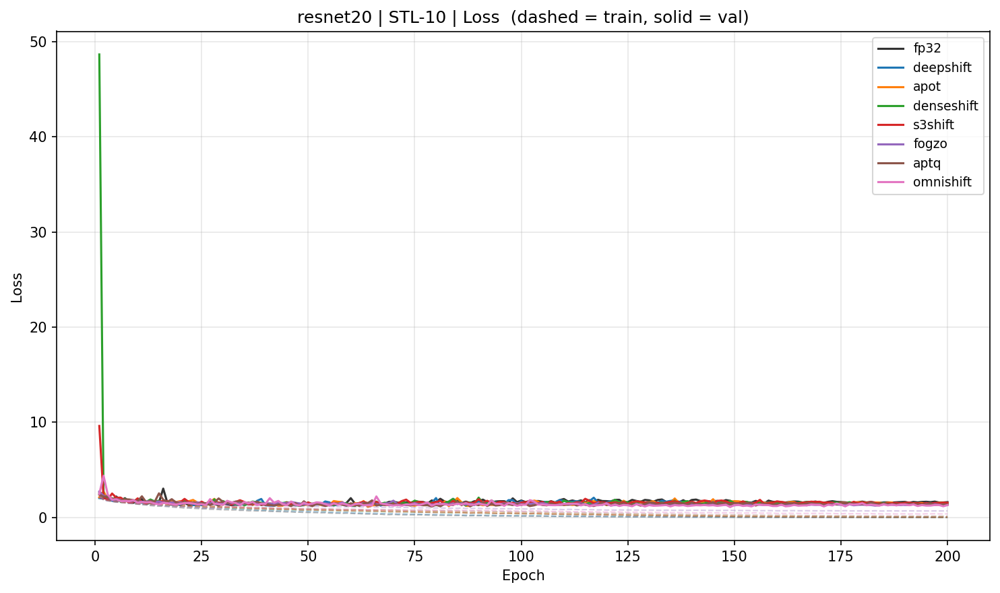 | 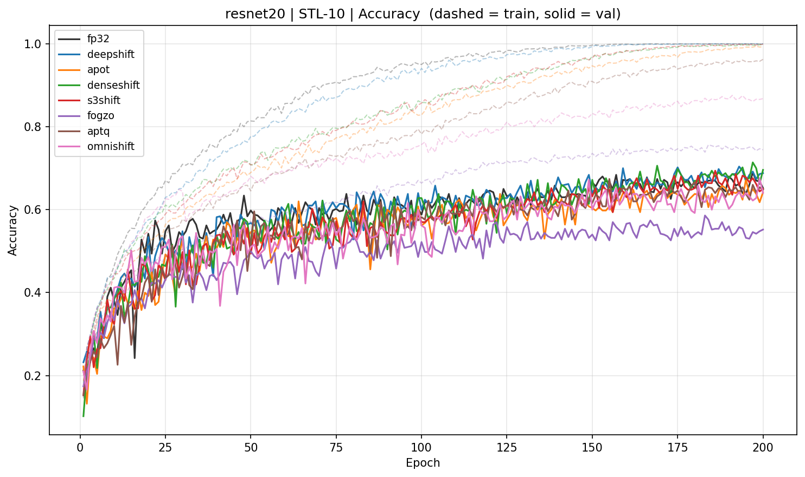 |

### ResNet-56

| Dataset | Loss | Accuracy |
|---------|:----:|:--------:|
| CIFAR-10 | 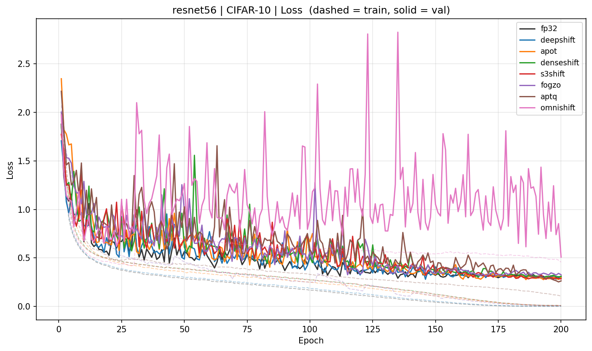 | 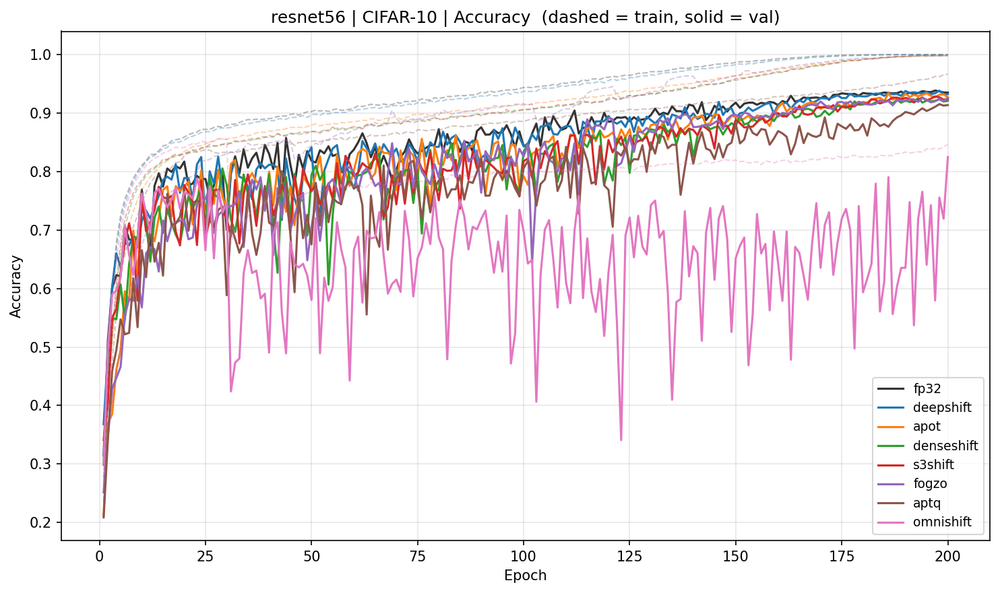 |
| SVHN | 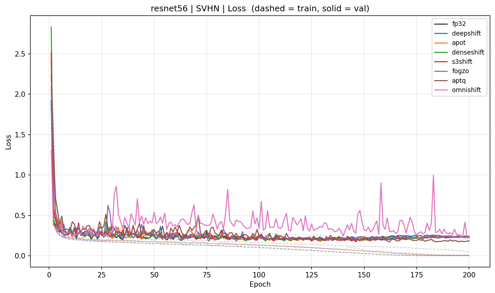 | 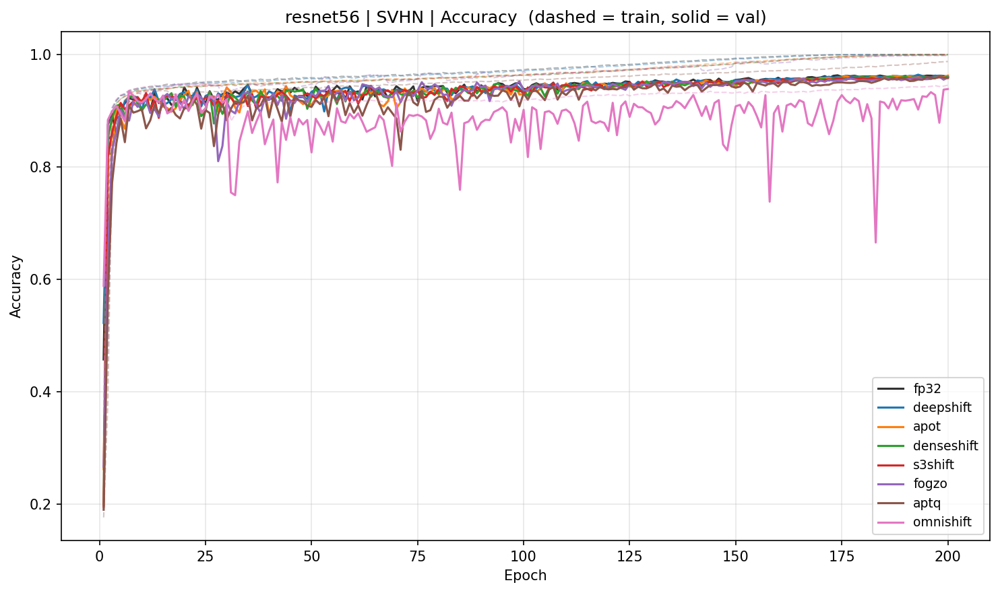 |
| STL-10 | 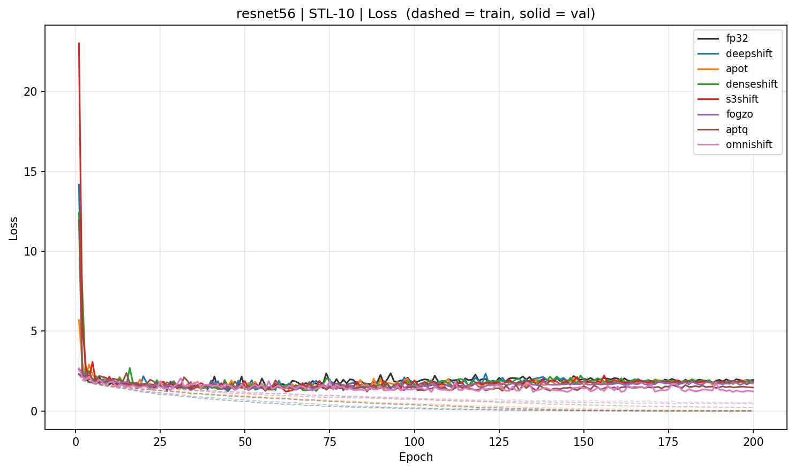 | 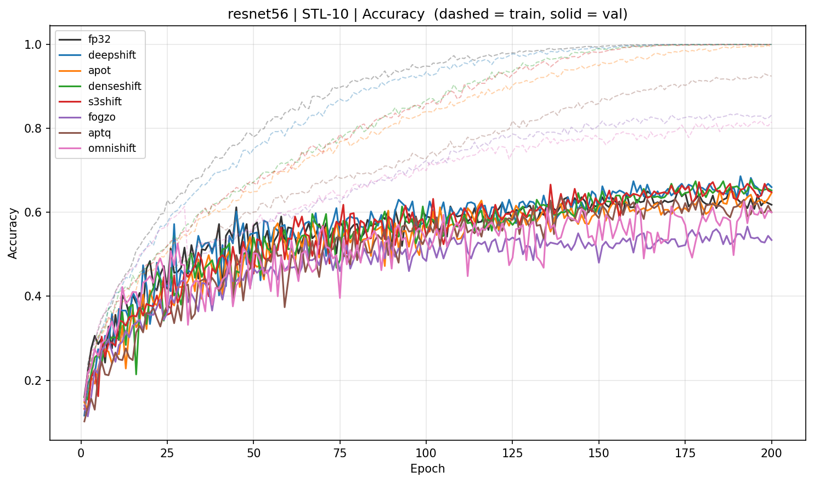 |

---

## Hyperparameters

| Param | Default |
|-------|---------|
| Epochs | 200 |
| Batch size | 256 |
| LR | 0.1 (cosine decay) |
| Momentum | 0.9 |
| Weight decay | 5e-4 |
| Sparsity lambda | 1e-4 (learnable mode) |
| BN warmup | 30 epochs |
| EWGS lambda | 0.02 |
| PoT-Act levels | 8 |

Val split: 10% of train, `torch.Generator(seed=42)`.

---

## References

- [DeepShift](https://arxiv.org/abs/1905.13298) - Elhoushi et al., CVPR-W 2021
- [APoT](https://arxiv.org/abs/1909.13144) - Li et al., ICLR 2020
- [DenseShift](https://arxiv.org/abs/2208.09708) - Li et al., ICCV 2023
- [S3](https://arxiv.org/abs/2107.03453) - Li et al., NeurIPS 2021
- [EWGS](https://arxiv.org/abs/2104.00903) - Lee et al., CVPR 2021
- [FOGZO](https://arxiv.org/abs/2510.23926) - Yang & Aamodt, NeurIPS 2025
- [APTQ](https://doi.org/10.3390/s24010181) - Liu et al., Sensors 2024